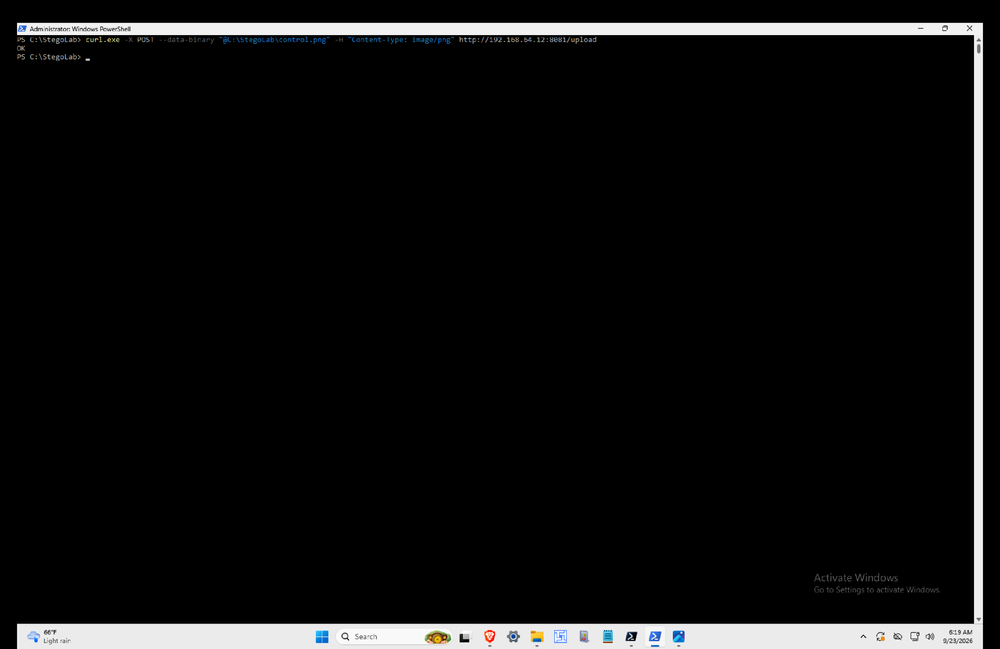
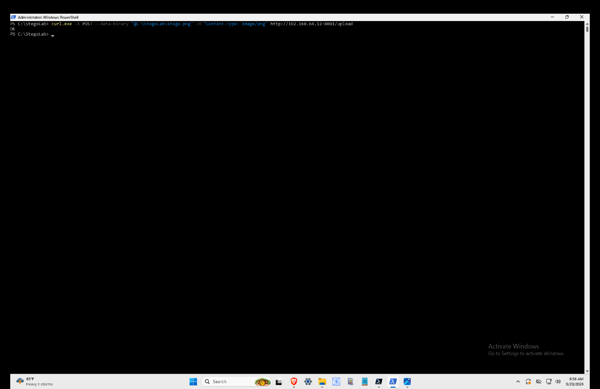

# Hidden Data Exfiltration Detection Lab

> **2 controlled image uploads. 77 bytes of additional data. 3 detection stages. 2 custom Suricata rules. 1 detection gap investigated from baseline through tuning.**

A hands-on SOC and detection engineering investigation into what network telemetry actually reveals when additional data is carried inside an image upload.

The goal was not simply to make an alert fire.

The goal was to establish a baseline, generate controlled behavior, inspect the telemetry, compare it against ground truth, identify the detection gap, build detection logic, tune it, and validate both positive and negative cases.

> **Key takeaway: Visibility is not the same as detection.**

---

## Lab Architecture


The lab used a Windows endpoint to send controlled PNG uploads over cleartext HTTP to an Ubuntu receiver while Suricata inspected the traffic on `enp0s1`.

Two samples followed the same path:

- `control.png` — 17,824 byte clean baseline
- `stego.png` — 17,901 byte modified carrier containing 77 additional bytes

Suricata recorded the network telemetry in `eve.json`.

The investigation then progressed through the existing alert and two custom detection iterations.

---

## At a Glance

| Item | Result |
|---|---|
| Windows endpoint | `192.168.64.17` |
| Ubuntu SOC host | `192.168.64.12` |
| Protocol | HTTP |
| Destination port | `8081` |
| Network sensor | Suricata 7.0.3 |
| Clean PNG | 17,824 bytes |
| Modified carrier | 17,901 bytes |
| Difference | 77 bytes |
| Existing alert | SID `2034635` |
| Detection V1 | SID `1000010` |
| Detection V2 | SID `1000011` |
| V1 control result | ALERT |
| V1 modified result | ALERT |
| V2 control result | NO ALERT |
| V2 modified result | ALERT |

---

## Scope and Accuracy

This project investigates an **image carrier containing appended test data**.

It does not use LSB, pixel manipulation, or another image steganography algorithm.

The modified file remained a valid PNG, but controlled ASCII data was appended after the PNG data.

Detection V2 also searches for a known test marker.

Therefore:

> **This project does not claim to provide universal steganography detection.**

The purpose was to investigate the difference between:

```text
Network visibility
        ↓
Behavior detection
        ↓
Detection specificity
        ↓
Validation
        ↓
Tuning
```

---

# Investigation Question

The scenario was deliberately controlled.

First, a normal PNG would be uploaded over HTTP.

Then a modified copy carrying additional controlled data would be uploaded through the same path.

Suricata would monitor both.

I wanted to answer four questions:

1. What does Suricata actually observe?
2. Does the existing alert distinguish the two transfers?
3. Can I reliably detect the upload behavior?
4. Can I tune the detection and prove the difference using both positive and negative tests?

---

# Lab Environment

| Component | Purpose |
|---|---|
| Windows endpoint | Traffic source |
| `192.168.64.17` | Windows lab IP |
| Ubuntu | Receiver and Suricata host |
| `192.168.64.12` | Ubuntu lab IP |
| TCP `8081` | HTTP receiver |
| `enp0s1` | Suricata monitoring interface |
| Suricata 7.0.3 | Network monitoring and detection |
| EVE JSON | Network telemetry |
| PowerShell | Artifact preparation |
| curl | Controlled HTTP uploads |
| jq | EVE JSON investigation |
| Python HTTP server | Upload receiver |

All activity was performed inside systems and network infrastructure under my control.

---

# Phase 1: Establish the Baseline

I started with a clean PNG:

```text
control.png
```

File size:

```text
17,824 bytes
```

SHA256:

```text
5BC7002B5E287EC1091B040DA49434F9EB60734584BC6FAC495CFD77FCA910D7
```

The image was uploaded from Windows:

```powershell
curl.exe -X POST --data-binary "@C:\StegoLab\control.png" -H "Content-Type: image/png" http://192.168.64.12:8081/upload
```

The receiver returned:

```text
OK
```

The received object produced the same SHA256:

```text
5bc7002b5e287ec1091b040da49434f9eb60734584bc6fac495cfd77fca910d7
```

This established the baseline:

```text
Known file
        ↓
Known size
        ↓
Known hash
        ↓
Known network path
        ↓
Successful transfer
```

The source and destination hashes matched.

### Evidence



---

# Phase 2: Create the Experimental Carrier

I created a controlled test marker:

```text
STEGOLAB_TEST_MARKER_2026
```

The marker was stored in:

```text
C:\StegoLab\secret.txt
```

I then created a copy of the clean PNG and appended controlled ASCII data.

The resulting artifact was:

```text
stego.png
```

File size:

```text
17,901 bytes
```

SHA256:

```text
BEC85B9965F2B109793D7540933E2AA24CEA8F7721360A260213BD535EF4F50F
```

The difference between the samples was:

```text
17,901 - 17,824 = 77 bytes
```

The modified carrier continued to render normally as a PNG.

### Important Technical Distinction

The payload was appended after the PNG data.

It was **not hidden inside image pixels**.

This distinction is important because the experiment should not be represented as LSB or general steganography detection.

---

# Phase 3: Transfer the Modified Carrier

The modified carrier followed exactly the same network path:

```powershell
curl.exe -X POST --data-binary "@C:\StegoLab\stego.png" -H "Content-Type: image/png" http://192.168.64.12:8081/upload
```

Response:

```text
OK
```

Ubuntu received:

```text
17,901 bytes
```

Received SHA256:

```text
bec85b9965f2b109793d7540933e2aa24cea8f7721360a260213bd535ef4f50f
```

The source and destination hashes matched.

### Ground Truth Validation

I then searched the received object for the controlled marker:

```bash
grep -a -o 'STEGOLAB_TEST_MARKER_2026' ~/stego-exfil-lab/uploads/control_received.png
```

Result:

```text
STEGOLAB_TEST_MARKER_2026
```

This closed the ground truth loop:

```text
Marker created
        ↓
Added to carrier
        ↓
Carrier uploaded
        ↓
Destination hash matched
        ↓
Marker recovered
```

The additional test data crossed the monitored connection and arrived intact.

### Evidence



---

# Phase 4: What Did Suricata See?

Suricata parsed both transactions as HTTP.

## Clean Control

```text
Source:          192.168.64.17
Destination:     192.168.64.12:8081
HTTP Method:     POST
URI:             /upload
User Agent:      curl/8.21.0
HTTP Status:     200
File Size:       17,824 bytes
Bytes To Server: 18,891
```

## Modified Carrier

```text
Source:          192.168.64.17
Destination:     192.168.64.12:8081
HTTP Method:     POST
URI:             /upload
User Agent:      curl/8.21.0
HTTP Status:     200
File Size:       17,901 bytes
Bytes To Server: 18,968
```

The object sizes differed by:

```text
77 bytes
```

The flow bytes to the server also differed by:

```text
18,968 - 18,891 = 77 bytes
```

Suricata therefore had visibility into the additional transferred bytes.

But that did not mean the existing detection understood what those bytes represented.

---

# Phase 5: Existing Detection

Both transfers generated the same existing Suricata alert:

```text
SID: 2034635
Signature: ET INFO Python BaseHTTP ServerBanner
Category: Misc activity
Severity: 3
Direction: to_client
```

The result was:

```text
Clean control
      ↓
SID 2034635


Modified carrier
      ↓
SID 2034635
```

The alert identified an aspect of the Python HTTP service.

It did not distinguish the modified carrier from the clean control.

It also did not identify the controlled marker.

That became the detection gap.

> **The traffic was visible. The condition I cared about was not distinguished by the existing alert.**

### Evidence


---

# Detection Hypothesis

My first custom detection intentionally targeted the transfer behavior.

Hypothesis:

> An HTTP POST from the Windows endpoint to the lab upload service should be detectable as upload behavior.

The purpose was not yet to identify the additional data.

I first wanted to prove that the behavior carrying it could be detected reliably.

---

# Phase 6: Detection V1

Detection V1:

```text
SID: 1000010
LAB Possible Data Upload via HTTP POST
```

Rule:

```text
alert http 192.168.64.17 any -> 192.168.64.12 8081 (msg:"LAB Possible Data Upload via HTTP POST"; flow:established,to_server; http.method; content:"POST"; sid:1000010; rev:1;)
```

Expected:

```text
Control   → ALERT
Modified  → ALERT
```

Actual:

```text
Control   → ALERT
Modified  → ALERT
```

Detection V1 successfully detected the HTTP upload behavior.

But it could not distinguish the modified carrier from the clean baseline.

### Evidence


---

# Troubleshooting Detection V1

Detection V1 did not work immediately.

The rule passed configuration validation:

```bash
sudo suricata -T -c /etc/suricata/suricata.yaml
```

Suricata reported that the configuration loaded successfully.

But SID `1000010` did not fire.

I checked the investigation layers separately:

```text
Traffic reaching sensor       YES
HTTP parsed                    YES
Method = POST                  YES
Source IP correct              YES
Destination IP correct         YES
Destination port correct       YES
Rule syntax valid              YES
Alert generated                NO
```

The running ruleset showed:

```text
rules_loaded: 51904
rules_failed: 0
rules_skipped: 0
```

I then queried Suricata's active default rule path:

```bash
sudo suricatasc -c "conf-get default-rule-path"
```

Result:

```text
/var/lib/suricata/rules
```

I had originally placed the rule in:

```text
/etc/suricata/rules/local.rules
```

But Suricata was resolving `local.rules` from:

```text
/var/lib/suricata/rules/local.rules
```

## Root Cause

The rule was valid.

It was simply in the wrong rule file.

I moved the custom detection into the active rule path and reloaded the rules:

```bash
sudo suricatasc -c reload-rules
```

Result:

```text
{"message": "done", "return": "OK"}
```

Detection V1 then fired successfully.

### Troubleshooting Lesson

> **Valid syntax does not guarantee an active detection.**

During detection troubleshooting, I need to separate:

```text
Telemetry
Rule syntax
Rule loading
Rule logic
Alert generation
```

---

# Troubleshooting the HTTP Receiver

During another control test, Windows returned:

```text
curl: (7) Failed to connect to 192.168.64.12:8081
```

I checked the Ubuntu listener:

```bash
sudo ss -lntp | grep ':8081'
```

Nothing was listening.

The Python receiver had stopped.

I restarted it:

```bash
cd ~/stego-exfil-lab && python3 receiver.py
```

The receiver began accepting uploads again.

This was a service availability problem.

It was not a Suricata detection problem.

That distinction prevented unnecessary changes to the detection logic.

---

# Troubleshooting EVE JSON

During telemetry analysis, at least one malformed historical JSON record caused direct `jq` parsing errors against `eve.json`.

Instead of treating the entire log as unusable, I processed the records individually and ignored malformed lines.

Example:

```bash
sudo tail -n 3000 /var/log/suricata/eve.json | while IFS= read -r line; do printf '%s\n' "$line" | jq -c 'FILTER' 2>/dev/null; done
```

This allowed the valid Suricata records to remain usable for the investigation.

---

# Phase 7: Detection Tuning

Detection V1 answered:

> Can I detect the upload behavior?

Yes.

But it could not answer:

> Can I distinguish the controlled modified sample from the clean control?

The V1 result was:

```text
CONTROL
   ↓
ALERT

MODIFIED
   ↓
ALERT
```

That became the tuning problem.

Before building Detection V2, I verified Suricata's HTTP request body inspection limit.

Configuration:

```text
request-body-limit: 100kb
```

Both samples were approximately 18 KB.

They were therefore within the configured request body inspection limit for this experiment.

---

# Phase 8: Detection V2

Detection V2 was deliberately built as a **lab validation rule**.

Instead of detecting every POST, it inspected the HTTP request body for the controlled marker.

```text
SID: 1000011
LAB Hidden Marker in HTTP Upload
```

Rule:

```text
alert http 192.168.64.17 any -> 192.168.64.12 8081 (msg:"LAB Hidden Marker in HTTP Upload"; flow:established,to_server; http.request_body; content:"STEGOLAB_TEST_MARKER_2026"; sid:1000011; rev:1;)
```

The objective was specific:

```text
Clean sample
should remain silent

Modified sample
should alert
```

---

# Phase 9: Negative Validation

I uploaded `control.png` again.

Expected:

```text
SID 1000011 → NO ALERT
```

Actual:

```text
SID 1000011 → NO ALERT
```

This was intentional silence.

The controlled marker did not exist in the clean sample.

The negative test therefore behaved as expected.

### Intentional Silence Record

```text
Rule:
SID 1000011

State:
Intentionally quiet

Condition:
Clean control upload

Reason:
Known validation marker absent

Owner:
Lab analyst

Review condition:
Review if Detection V2 logic is changed or expanded
```

### Evidence


---

# Phase 10: Positive Validation

I then uploaded `stego.png`.

Suricata generated:

```text
SID:          1000011
Signature:    LAB Hidden Marker in HTTP Upload
Source:       192.168.64.17
Destination:  192.168.64.12
Port:         8081
Direction:    to_server
HTTP Method:  POST
URI:          /upload
File Size:    17,901 bytes
```

Flow ID:

```text
2203588266728211
```

Result:

```text
Modified carrier → ALERT
```

The positive sample behaved as expected.

### Evidence


---

# Final Detection Matrix

| Sample | Size | Existing SID 2034635 | V1 SID 1000010 | V2 SID 1000011 |
|---|---:|---|---|---|
| Clean control | 17,824 B | ALERT | ALERT | NO ALERT |
| Modified carrier | 17,901 B | ALERT | ALERT | ALERT |

The investigation moved through three stages:

```text
EXISTING DETECTION

Control  → ALERT
Modified → ALERT

Result:
Did not distinguish the samples.


DETECTION V1

Control  → ALERT
Modified → ALERT

Result:
Successfully detected upload behavior.
Still too broad for sample distinction.


DETECTION V2

Control  → NO ALERT
Modified → ALERT

Result:
Successfully distinguished the controlled
known marker test.
```

---

# Detection Tuning Summary

The main tuning change was:

```text
Detection V1
        ↓
Detect HTTP POST
        ↓
Control alerts
Modified alerts
        ↓
Too broad
        ↓
Detection V2
        ↓
Inspect HTTP request body
for controlled marker
        ↓
Control stays silent
Modified alerts
```

Detection V2 proved that Suricata could inspect the relevant HTTP request body and match the known marker.

It does **not** prove arbitrary hidden data or arbitrary steganography can be detected with this rule.

---

# What the Experiment Proved

The evidence supports these conclusions:

**1. Both transfers were visible to Suricata.**

**2. The modified carrier contained 77 additional bytes.**

**3. Those 77 additional bytes crossed the monitored network.**

**4. The known marker survived the transfer.**

**5. The existing SID `2034635` fired on both samples and did not distinguish them.**

**6. Detection V1 reliably detected the HTTP POST behavior but fired on both samples.**

**7. Detection V2 remained silent for the clean control.**

**8. Detection V2 alerted on the modified carrier containing the known marker.**

Anything beyond those conclusions would require additional testing.

---

# Lessons Learned

## Visibility Does Not Equal Detection

Suricata could see both transactions.

That did not mean the existing detection understood what made the second transaction different.

## An Alert Firing Is Not Enough

Detection V1 worked technically.

But because both the clean and modified samples triggered it, the rule did not answer the more specific detection question.

## Controls Strengthen Detection Testing

Without the clean control, I could have seen Detection V1 fire on the modified sample and incorrectly concluded that I had built a useful detector.

The negative control exposed that the detection was broader than the behavior I wanted to distinguish.

## Ground Truth Comes First

Before evaluating detection performance, I verified:

```text
Source artifact
Destination artifact
File size
SHA256
Marker recovery
Network telemetry
```

That gave the experiment known ground truth.

## Intentional Silence Matters

The absence of SID `1000011` during the clean control test was expected.

That silence was part of successful validation.

## Troubleshooting Needs Layers

This project produced several unrelated failures:

```text
Artifact creation
Receiver availability
Rule location
JSON parsing
Detection specificity
```

Treating every problem as a rule problem would have produced unnecessary changes.

---

# What I'd Improve

This experiment answered the controlled question, but it also created several clear next steps.

## True Image Steganography

The next iteration should use controlled LSB or another genuine image steganography technique instead of appended data.

That would test a substantially different hiding mechanism.

## HTTPS

This experiment used cleartext HTTP.

Repeating it over HTTPS would demonstrate how encrypted transport changes network sensor visibility.

## Endpoint Telemetry

I would add endpoint evidence around:

```text
File creation
Process execution
PowerShell activity
Network connection
Upload process
```

This would allow endpoint and network telemetry to be correlated.

## Behavioral Detection

A production-oriented investigation should move beyond a known marker.

Potential contextual signals could include:

```text
Unusual destination
Unexpected upload process
Rare destination port
Transfer volume
Host baseline deviation
Destination reputation
File characteristics
```

These signals would need testing and tuning against legitimate traffic.

## More Negative Controls

I would use multiple legitimate PNG files with different sizes.

That would make it easier to demonstrate why simple file size thresholds would overfit this experiment.

## More Positive Samples

I would test different payload contents and carrier sizes.

A detection should survive variation rather than succeeding against only one artifact.

---

# Limitations

## Not Pixel Based Steganography

The controlled data was appended after the PNG data.

It was not hidden inside pixel values.

## Known Marker Dependency

Detection V2 searches for:

```text
STEGOLAB_TEST_MARKER_2026
```

Unknown content would not necessarily trigger it.

## Cleartext HTTP

The experiment used HTTP.

Encrypted HTTPS traffic would materially change what Suricata could inspect without additional decryption capabilities.

## File Size Is Not a Reliable Detection

The 77 byte difference was useful experimental evidence.

It should not become a production rule such as:

```text
PNG larger than 17,824 bytes = suspicious
```

Legitimate images naturally vary in size.

## HTTP POST Is Broad

POST requests are common legitimate behavior.

Detection V1 was deliberately broad to demonstrate that detecting a transport behavior is different from detecting the condition being investigated.

---

# Skills Demonstrated

This project exercised practical skills in:

```text
SOC investigation
Detection engineering
Baseline establishment
Control testing
Hypothesis development
Network telemetry analysis
Suricata
EVE JSON analysis
HTTP analysis
Custom IDS rule development
Positive testing
Negative testing
Detection tuning
Rule validation
Detection troubleshooting
Service troubleshooting
Ground truth validation
SHA256 verification
Intentional silence documentation
Evidence based reporting
Detection limitation analysis
```

---

# Detection Rules

The custom Suricata rules are stored in:

```text
rules/
├── detection-v1.rules
└── detection-v2.rules
```

## Detection V1

```text
alert http 192.168.64.17 any -> 192.168.64.12 8081 (msg:"LAB Possible Data Upload via HTTP POST"; flow:established,to_server; http.method; content:"POST"; sid:1000010; rev:1;)
```

## Detection V2

```text
alert http 192.168.64.17 any -> 192.168.64.12 8081 (msg:"LAB Hidden Marker in HTTP Upload"; flow:established,to_server; http.request_body; content:"STEGOLAB_TEST_MARKER_2026"; sid:1000011; rev:1;)
```

---

# Evidence

The repository contains genuine screenshots captured during the experiment.

```text
evidence/
├── 01-baseline-control-transfer.png
├── 02-modified-carrier-transfer.png
├── 03-existing-detection-comparison.png
├── 04-detection-v1-validation.png
├── 05-detection-v2-negative-test.png
└── 06-detection-v2-positive-test.png
```

The screenshots are evidence.

The architecture diagram is explanatory and is **not** treated as experimental evidence.

---

# Repository Structure

```text
hidden-data-exfiltration-detection-lab/
│
├── README.md
│
├── architecture/
│   └── lab-architecture.png
│
├── evidence/
│   ├── 01-baseline-control-transfer.png
│   ├── 02-modified-carrier-transfer.png
│   ├── 03-existing-detection-comparison.png
│   ├── 04-detection-v1-validation.png
│   ├── 05-detection-v2-negative-test.png
│   └── 06-detection-v2-positive-test.png
│
├── rules/
│   ├── detection-v1.rules
│   └── detection-v2.rules
│
└── docs/
    └── investigation-notes.md
```

---

# How I Would Explain This in an Interview

> I wanted to understand the difference between network visibility and useful detection, so I built a controlled image carrier exfiltration experiment.
>
> I established a clean PNG as my baseline and created a modified copy containing a known test marker. I transferred both through the same HTTP path while monitoring the traffic with Suricata.
>
> The existing Suricata alert fired on both transfers but identified the Python HTTP server rather than distinguishing the modified carrier.
>
> My first custom detection identified the HTTP POST behavior. It worked, but testing it against the control showed that it was too broad because both samples triggered it.
>
> I then built a second lab validation rule around the known marker. The clean control remained silent while the modified carrier generated the expected alert.
>
> The main lesson was not that I had built a universal steganography detector, because I had not. The value was working through the full process from hypothesis and baseline to ground truth, telemetry analysis, detection development, negative testing, tuning, and evidence backed conclusions.

---

# Final Takeaway

```text
Seeing traffic
      ≠
Understanding behavior
      ≠
Detecting the condition
      ≠
Having a useful detection
```

This lab reinforced the workflow I want to continue using for detection engineering:

```text
Question
   ↓
Hypothesis
   ↓
Baseline
   ↓
Generate Behavior
   ↓
Collect Telemetry
   ↓
Establish Ground Truth
   ↓
Identify Detection Gap
   ↓
Build Detection
   ↓
Test
   ↓
Tune
   ↓
Negative Validation
   ↓
Positive Validation
   ↓
Document Limitations
```

**Baseline it. Generate it. Observe it. Detect it. Test what should stay silent. Tune from evidence.**

---

## Disclaimer

This project was conducted in an isolated home lab using systems and network traffic under my control.

It is intended for defensive security research, SOC training, and detection engineering practice.
